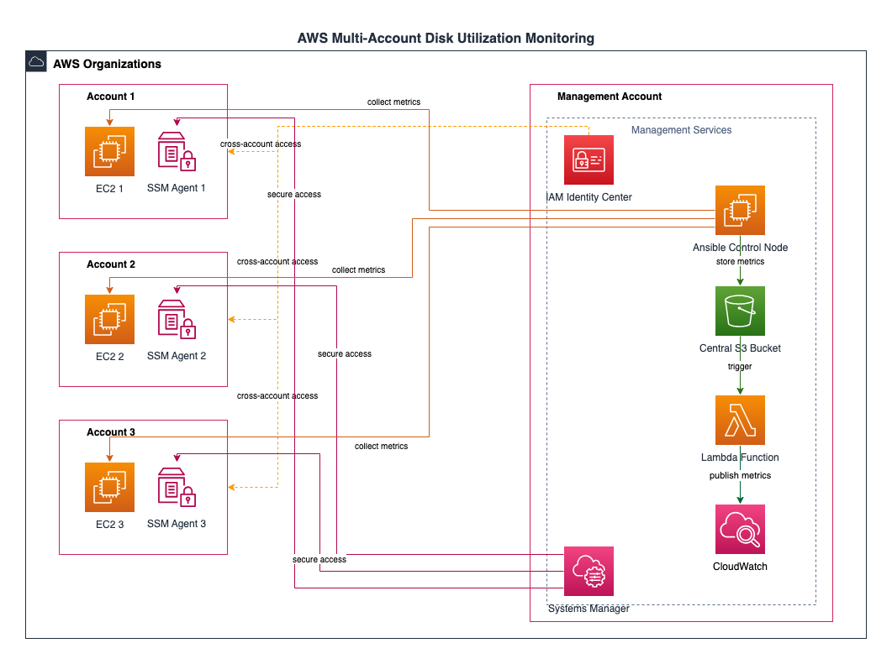

## Overview
This solution implements centralized disk utilization monitoring across multiple AWS accounts using Ansible automation, AWS Systems Manager, and CloudWatch services.



## Features
- Centralized monitoring of disk utilization across multiple AWS accounts
- Automated deployment and configuration
- Real-time alerting and reporting
- Scalable architecture for future account additions
- Secure cross-account access using AWS IAM Identity Center

## Prerequisites
- AWS Organizations setup
- Management account with administrative access
- Member accounts configured
- AWS CLI installed and configured
- Ansible (version 2.9 or higher)
- Python 3.8 or higher

## Quick Start
1. Clone this repository
```bash
git clone https://github.com/rugved1991/ec2-disk-monitoring-ansible.git
cd disk-monitoring
```

2. Install required collections
```bash
ansible-galaxy collection install -r requirements.yml
```

3. Configure AWS credentials
```bash
aws configure
```

4. Update inventory with your account details in `src/inventory/inventory.ini`

5. Deploy the solution
```bash
ansible-playbook -i src/inventory/inventory.ini src/site.yml
```

## Documentation
- [Architecture Overview](docs/architecture.md)
- [Implementation Details](docs/implementation.md)
- [Deployment Guide](docs/deployment.md)
- [Maintenance Guide](docs/maintenance.md)

## Directory Structure
```plaintext
disk-monitoring/
├── README.md
├── docs/
│   ├── architecture.md
│   ├── implementation.md
│   ├── deployment.md
│   └── maintenance.md
├── src/
│   ├── inventory/
│   │   └── inventory.ini
│   ├── group_vars/
│   │   └── all.yml
│   ├── roles/
│   │   └── disk-monitoring/
│   │       ├── tasks/
│   │       │   ├── main.yml
│   │       │   └── collect.yml
│   │       └── templates/
│   │           ├── cloudwatch-config.json.j2
│   │           └── dashboard.json.j2
│   └── site.yml
├── tests/
│   ├── playbook_tests.yml
│   ├── integration_tests.yml
│   ├── security_tests.yml
│   ├── performance_tests.yml
│   └── inventory_test.ini
└── images/
    └── architecture.png

```

## Security
This solution follows AWS security best practices including:
- IAM roles for cross-account access
- Systems Manager for secure command execution
- Encrypted data storage
- No hardcoded credentials

